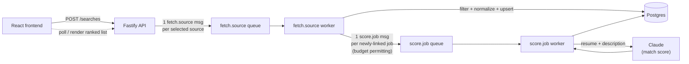

# AI-Assisted Job Search

[](https://github.com/griesmnr/ai-assisted-job-search/actions/workflows/ci.yml)

You pick which job boards to search, paste in a resume, and get back postings
ranked by an AI-generated match score against that resume, best match first.
Under the hood it fans a search out across several independent, unreliable
job-board APIs and treats that unreliability as the actual design problem,
not an edge case.

This is a working pipeline against live data, not a canned demo: it queries
real job board APIs and scores real, currently open postings against a real
resume, and every number in this README came from a real run or a real
commit, not a projection.

## What it does, today

The real path today runs end to end through the queue-driven architecture
diagrammed below: the React frontend calls the Fastify REST API, which
publishes to RabbitMQ, and two long-lived worker processes fetch/normalize/
filter postings and score them against a resume via Claude.
`apps/api/src/demo-match.ts` is a separate, CLI-only entry point into the
same underlying pipeline (`apps/api/src/matching/pipeline.ts`) — useful for
running a search from a terminal without starting the queue workers, not
the only way to run this any more. See [Current state](#current-state) for
exactly what's real.

- Eight job-board sources (USAJOBS, Greenhouse, Lever, Ashby,
  SmartRecruiters, Workable, Recruitee, Rippling), covering a U.S.
  federal-jobs API and several dozen configured ATS employers, selectable
  per search via source toggles.
- Postings are normalized into one `Job` shape, filtered down to
  software-engineering roles matching a caller's criteria, deduplicated, and
  scored against a resume by Claude — each score comes back as a 0-100
  number plus a rationale, strengths, gaps, and a separate leveling-fit
  judgment, not free text.
- Jobs, resumes, and match scores are persisted, so re-running a search
  never re-pays for a score it already has; a user's saved/applied/
  dismissed status on a job is tracked too.

## Current state

Built, tested, and what `POST /searches` actually runs in production today:

- Eight source adapters (USAJOBS, Greenhouse, Lever, Ashby,
  SmartRecruiters, Workable, Recruitee, Rippling) behind one `JobSource`
  interface, each with its own idiosyncrasies handled — see
  [Source adapters](#source-adapters).
- A Postgres schema (Drizzle) with idempotent upserts on jobs, resumes,
  match scores, and per-search scoring-failure records.
- A RabbitMQ topology with per-queue dead-letter exchanges and a
  tiered-backoff retry path (see
  [Retries, dead letters, and idempotency](#retries-dead-letters-and-idempotency)),
  plus `fetch.source` and `score.job` workers that consume it as real,
  long-lived processes (`apps/api/src/worker/`) — not just designed, both
  running end to end against real search traffic.
- A full REST API (`apps/api/src/routes/`) — resumes, sources, starting and
  polling a search, per-job status, and the resume-tailoring-app handoff —
  see [Running it locally](#running-it-locally) for the exact routes this
  README exercises.
- A React frontend (`apps/web`) — source toggles, resume input with
  AI-suggested title chips, a search-criteria form, a polling results view,
  per-job status controls, and the "Optimize Resume" handoff.
- The shortlist-truncation bug this section used to describe as open (a
  fixed `slice(0, 12)` silently dropping most of the ranked list once the
  candidate pool grew) is fixed: every survivor is a scoring candidate, a
  shared per-search cap (`DEFAULT_SCORE_THRESHOLD = 200`) bounds spend
  instead of coverage, and when it binds it's reported, never silent — see
  [What "adversarial review" actually catches](#what-adversarial-review-actually-catches).

Known limitation:

- **One seeded source, Washington state's own job board (`wa-state`), has
  no adapter yet** (the ninth seeded id, alongside the eight real
  adapters above). It shows up everywhere as "no adapter implemented"
  rather than a misconfiguration — see `apps/api/src/sources/registry.ts`.

## Architecture



Two work queues, `fetch.source` and `score.job`, each with its own
dead-letter exchange. A search publishes one `fetch.source` message per
selected job source; each source that successfully ingests a job (subject
to the search's criteria filter and a shared per-search scoring cap)
publishes one `score.job` message for it. Both sides of this — topology,
workers, retry, DLQ — are built and run as real, long-lived processes; this
is the actual path `POST /searches` uses today, not a design still being
wired in. `apps/api/src/demo-match.ts` runs the same underlying pipeline
synchronously instead, for local iteration without the queue workers
running.

### Why a queue, not a direct fan-out

A search can hit up to eight independent job-board APIs that are unequal and
unreliable in different ways: one rate-limits, one 404s a mistyped board
name, one returns HTTP 200 with zero results for both a real employer with
no openings and a nonexistent one (see
[Source adapters](#source-adapters)). A synchronous fan-out means one slow
or failing source blocks or corrupts the whole search. A queue gives each
of the three patterns below an actual home instead of being bolted on
after the fact.

### Retries, dead letters, and idempotency

- **Retries.** A retryable failure (rate limit, transient network error) is
  republished into one of five backoff-tier queues
  (`fetch.source.retry.1s` … `.60s`) rather than retried inline. Each tier
  is its own durable queue with a queue-level TTL, not a shared queue with
  a per-message expiration — RabbitMQ only evaluates TTL at the head of a
  queue, so a shared queue with mixed per-message TTLs would let a
  long-TTL message block every shorter-TTL message queued behind it, which
  turns "back off gradually" into "wait, then retry everything against a
  struggling source at once." A non-retryable failure (bad credentials, a
  malformed response) skips retry entirely and dead-letters immediately —
  retrying a request that can never succeed just delays the operator
  finding out. Attempt count is tracked via an `x-attempt` message header,
  since RabbitMQ doesn't count attempts for you; the top 60s tier exists
  specifically because some sources hand back a `Retry-After` in that
  range, and without a tier that can hold that long the worker would clamp
  down to 8s and get rate-limited again inside the same window.
- **Dead-letter queues.** A message that exhausts its retries, or that was
  never retryable, lands in `fetch.source.dlq` or `score.job.dlq`. That
  source is then reportable as unavailable — distinct from "searched and
  found nothing" — while every other configured source still returns.
  Product behavior, not a demo: a search doesn't fail because one board is
  down.
- **Idempotency.** Jobs upsert on `(data_source, external_id)`; the
  `search_results` join table has a unique constraint on
  `(search_id, job_id)`; match scores are unique on `(resume_id, job_id)`;
  resumes are content-addressed by a sha256 hash so identical resume text
  is stored once. A redelivered `fetch.source` message (RabbitMQ's
  at-least-once delivery, or a worker dying mid-run) re-links existing rows
  instead of duplicating them, and never re-publishes a `score.job` message
  for a job it already ingested. This matters commercially, not just
  architecturally: without it, a redelivery re-scores a job through the
  Anthropic API and pays for it again.

## Source adapters

Every adapter implements the same `JobSource` interface
(`search(criteria) -> { jobs, skipped }`) but the seven ATS APIs in this
table disagree about almost everything else. USAJOBS is an eighth adapter
behind the same interface — its access method, auth, and terms are covered
in [ADR 001](docs/adr/001-job-sources.md) instead of here, since it's a
government API with different characteristics than an ATS vendor's, not
the same shape of "awkward."

| Source              | What makes it awkward                                                                                                                                                                                                                                                                                                                                                                                                                                                                     |
| ------------------- | ----------------------------------------------------------------------------------------------------------------------------------------------------------------------------------------------------------------------------------------------------------------------------------------------------------------------------------------------------------------------------------------------------------------------------------------------------------------------------------------- |
| **Greenhouse**      | No server-side location/keyword query support — every search downloads a whole board and filters client-side. No public directory maps a company name to its board token, so candidates have to be checked individually (`check-greenhouse-board.ts`) before being added; of 25 hand-guessed tokens in this project's own history, 7 (28%) weren't on Greenhouse at all, and 13 more (about half) resolved to real, sizeable boards that still contributed zero postings after filtering. |
| **Lever**           | Posting content is split across a plain-text summary field and a separate `lists` field that actually holds the requirements — reading only the summary field discards the majority of a posting's real content. Location is similarly split between one canonical field and an `allLocations` array that doesn't always agree with it; reading only one silently drops real matches, and it took three review rounds to land on reading the union of both correctly.                     |
| **Ashby**           | Location data is spread across a primary field, a `secondaryLocations` array, and a structured `address.postalAddress` block that's absent from the API response unless you read it — missing any one of the three silently zeroes out entire cities' worth of results. Compensation data only exists at all behind an undocumented query parameter.                                                                                                                                      |
| **SmartRecruiters** | Returns HTTP `200` with `totalFound: 0` for both a real employer with no current openings and a completely nonexistent company identifier — byte-identical responses. Distinguishing the two required an independent liveness check against the company's own careers-site redirect behavior. Descriptions live behind a separate per-posting detail endpoint, so a large employer can cost thousands of extra HTTP requests for one search.                                              |
| **Workable**        | The documented Accounts API endpoint 302-redirects to a widget host before it's usable at all — an invalid subdomain and a real one both look identical until that redirect is followed, at which point a real account resolves `200` (`jobs: []` for a genuinely quiet employer) and an unrecognized one resolves a clean, distinct `404`. No compensation field exists anywhere in the API.                                                                                             |
| **Recruitee**       | No pagination on the offers endpoint at all — a whole company's board comes back as one request, unlike SmartRecruiters' paginated list. `remote`/`hybrid`/`on_site` booleans, assumed mutually exclusive, aren't in real data — two real bunq postings assert both `hybrid` and `on_site` simultaneously, so the adapter requires exactly one true and maps zero-or-multiple to `undefined` rather than guessing a winner.                                                               |
| **Rippling**        | The list endpoint carries no description, company name, employment type, or pay data at all — every posting requires a mandatory per-posting detail fetch, same as SmartRecruiters. Worse, a job posted to multiple locations appears once PER LOCATION as separate rows sharing an identical `uuid`; failing to dedupe by `uuid` would insert the same posting into `jobs` multiple times under the same `(source, external_id)` key.                                                    |

## What "adversarial review" actually catches

Every change here goes through adversarial review by a stronger model
before it merges — its job is to find reasons the change should _not_
merge, not to approve it. That process has repeatedly caught the same
defect shape: code that passed its own tests while being silently,
materially wrong. A few examples, verifiable in the git history:

- The Lever adapter originally stored only a posting's marketing summary,
  discarding 69-74% of every posting's actual text — including every
  requirements section. The suite's one content assertion checked the
  marketing intro, which the bug left intact, so the test passed with
  69-74% of every posting missing (`c4e51ab`).
- Adversarial review caught that the Ashby adapter never read
  `address.postalAddress`: `search({ location: "New York City" })`
  returned zero results while 115 real postings were headquartered there.
  (The adapter had already caught a related gap on its own before review
  even started — a separate unread field, `secondaryLocations` — see
  [Source adapters](#source-adapters).) (`e5ca1f1`)
- A migration backfilling a resume-content hash used
  `"resume_text"::bytea`, which parses text as bytea _escape_ syntax, not
  raw bytes. A resume containing a Windows path like `C:\Users\...` aborted
  the migration outright; one containing a sequence like `\101` succeeded
  with a silently wrong hash — which meant the de-duplication this feature
  exists for would never fire, and every run would re-pay Anthropic for a
  resume it had already scored. It passed two prior reviews because the
  database had zero resume rows at the time, so the backfill had never
  actually executed (`2d3ff4c`).
- A test suite reported `83/83 tests passed` while the file itself had
  failed — the failure was in teardown, so the test count stayed green and
  hid it (`2d3ff4c`).
- Widening the search funnel from 545 postings to 11,609 across two
  tickets changed the ranked list a user actually sees by nothing, because
  a fixed `slice(0, 12)` took the first twelve survivors in source order
  rather than the best twelve — filed as a bug rather than silently shipped
  (`cc793ee`, ticket `16c824a`), and since fixed: every survivor is now a
  scoring candidate, bounded by a reported per-search cap instead of a
  silent truncation (see [Current state](#current-state)).

The recurring lesson: **make broken look different from empty.** That's
why every adapter reports a per-token/per-board `skipRate` distinct from a
board simply having no openings, why a 404'd board is recorded as a
`SkippedRecord` rather than silently dropped, and why a truncated run must
never look identical to a complete one.

## Running it locally

### Prerequisites

- Node.js 22+. `pnpm` itself doesn't need a separate install — this repo
  pins `pnpm@10.33.0` via `packageManager`, so `corepack enable` (ships
  with Node 22) makes the `pnpm` command resolve to the pinned version.
- Docker Desktop, for Postgres and RabbitMQ.
- An Anthropic API key — not needed for `pnpm install`, migrations, or
  `pnpm test`/`pnpm lint`, but required before step 5 (`demo-match.ts`; see
  that step for why it can't be skipped silently), and again for step 7's
  scoring worker and for real (non-`estimateOnly`) `POST /searches` calls
  in step 6 — the same key, just two different processes that each need
  it in their own environment.

### 1. Enable pnpm and configure environment

```bash
corepack enable
[ -f .env ] || cp .env.example .env
```

That guard matters: a bare `cp .env.example .env` silently **overwrites**
an existing `.env`, and since `.env` is gitignored there is no undo. The
command above only copies the template when `.env` doesn't already exist.

Then edit `.env` and fill in `ANTHROPIC_API_KEY` if you want to run real
scoring. The Postgres/RabbitMQ credentials and the default employer lists
for each source adapter already have working values in `.env.example`.

### 2. Start Postgres and RabbitMQ

```bash
docker compose up -d
docker compose ps    # postgres and rabbitmq should both show healthy
```

Both containers publish to `127.0.0.1` only, not `0.0.0.0` — deliberate,
since `.env.example` ships with placeholder credentials. `docker compose
down` keeps their data in named volumes (including anything
dead-lettered, which matters on a project whose point is demonstrating
DLQs); `docker compose down -v` wipes it.

### 3. Install dependencies and run migrations

```bash
pnpm install
pnpm --filter @app/api db:migrate
```

### 4. Run the tests

```bash
pnpm test          # vitest run
pnpm lint           # eslint . && prettier --check .
```

`vitest.config.ts` aliases `@app/shared` to its TypeScript source, so tests
run against current source without a build step first. 16 test files
connect to a real Postgres instance — every `db/migration-*.test.ts` except
`migration-0006.test.ts` (deliberately connection-free, see its own header),
plus `db/schema.test.ts`, `db/seed.test.ts`, `db/user-job-statuses.test.ts`,
`demo-match.test.ts`, `ingest/ingestJobs.test.ts`, every `routes/*.test.ts`
except `sources.test.ts` (uses a fake db), `scripts/rescore-existing-matches.test.ts`,
and both `worker/*.test.ts` files — with `worker/fetchSourceWorker.test.ts` and
`worker/scoreJobWorker.test.ts` also needing a real RabbitMQ connection —
so step 2 has to have happened first. (Stale here before this audit: this
paragraph still described the pre-epic file count — REST routes,
`scoreJobWorker`, and most of the migration tests were added by the same
work this whole README was rewritten to reflect, ticket 7472002.)

### 5. Run the end-to-end pipeline

`ANTHROPIC_API_KEY` must be set in `.env` before this step. The script
constructs its Anthropic client unconditionally and doesn't check for a
key up front, so without one it still runs the entire live fetch across
every configured source — SmartRecruiters alone can be 500+ HTTP
requests — and only then fails, on the first scoring call.

```bash
mkdir -p prep
[ -f prep/resume.txt ] || echo "paste your resume text here" > prep/resume.txt
# then edit prep/resume.txt to hold your actual resume text
npx tsx apps/api/src/demo-match.ts
```

The guard on that `echo` matters for the same reason as the `.env` one
above: `prep/` is gitignored, so overwriting `prep/resume.txt` by accident
has no undo.

It searches every source configured in `.env` (Greenhouse, Lever, Ashby,
SmartRecruiters — whichever have their env var set), filters to
software-engineering roles, scores each new posting against
`prep/resume.txt`, and persists jobs/resumes/scores to Postgres so a
second run doesn't re-score anything it already has.

### 6. Start the API and web dev servers

```bash
pnpm dev
```

That's the whole command — `pnpm dev` (root `package.json`: `pnpm --parallel
-r --if-present run dev`) starts `apps/api`'s Fastify server
(`http://localhost:3000`) and `apps/web`'s Vite dev server
(`http://localhost:5173`) together, in one terminal, each rebuilding on save.
No `.env`-loading cwd caveat: `apps/api/src/load-env.ts`'s `loadEnvFile()`
used to resolve `.env` relative to `process.cwd()`, which broke this exact
command (and `pnpm --filter @app/api dev`, and `cd apps/api && pnpm dev`)
with `error: role "dev" does not exist` — Postgres falling back to the OS
username once `POSTGRES_USER`/`PASSWORD`/`DB` silently never loaded. Fixed
(ticket `2fd6706`): it now resolves `.env` from the repo root via
`import.meta.url`, independent of the caller's working directory, so any of
those invocation forms loads the same `.env` correctly.

That fix is scoped to `.env` loading only — one separate, still-open
cwd-dependence remains. `POST /searches/estimate`'s pre-search cost figure
reads `prep/scoring-usage-stats.json` (also cwd-relative, unrelated
mechanism) to use real historical per-call averages instead of the
bootstrap estimate; started via `pnpm dev` (cwd `apps/api`), that read
misses and the estimate silently falls back to the less-accurate bootstrap
basis. Same underlying issue step 7 below warns about for the scoring
worker — not yet fixed for the route that reads it at estimate time
(ticket `2b93534`).

Open `http://localhost:5173` and the app is live against whatever
Postgres/RabbitMQ instance step 2 started.

### 7. Run the queue workers

Both workers are long-lived processes, meant to be started manually
(each in its own terminal, in the same dev-container shell step 4's tests
and step 5's pipeline already run in) — there is no docker-compose service
for either (see [Architecture](#architecture) for why the queue exists,
and the worker source files themselves for the retry/DLQ/idempotency
design). `RABBITMQ_*`/`POSTGRES_*` must be set (step 1); the scoring
worker additionally needs `ANTHROPIC_API_KEY`, same as step 5.

```bash
npx tsx apps/api/src/worker/run-fetch-source-worker.ts   # consumes fetch.source
npx tsx apps/api/src/worker/run-score-job-worker.ts      # consumes score.job
```

Run from the repo root, like step 5's `demo-match.ts` above -- **not**
`pnpm --filter @app/api worker:*`, which runs with `apps/api` as the
working directory. The scoring worker's usage-stats file
(`USAGE_STATS_PATH`, `scoreJobWorker.ts`) is a cwd-relative `prep/...`
path, matching every other `prep/`-touching entry point in this repo
(`demo-match.ts`, `rescore-existing-matches.ts`) -- running it from
`apps/api/` instead silently writes to `apps/api/prep/...`, a second,
disconnected usage-stats file the spend guard's cost estimate never sees
(opus review, ticket b53c422, F1). The `package.json` `worker:*` scripts
still exist for the built `:start` form, but the same cwd rule applies to
THEM too: `pnpm --filter @app/api worker:score-job:start` runs with
`apps/api/` as cwd exactly like the dev form does and reintroduces the
identical bug (re-review note, ticket b53c422) -- only invoking
`node dist/worker/run-score-job-worker.js` directly, from the repo root,
is safe. Nothing in this repo deploys via `pnpm --filter ...:start` today,
but don't assume it would be safe if that changes.

The scoring worker enforces a lifetime-per-process spend ceiling
(`ScoringSpendGuard`, `apps/api/src/worker/scoreJobWorker.ts`, ticket
b53c422) — once tripped, restart the process to reset it. `POST /searches`
does publish to the queue (tickets `4f88339`, `45ea34c`, `c9c676d`): both
workers above pick up real work from a real search, not just from a
hand-crafted test message — see the next step.

### 8. Run a real, queue-driven search end to end

The exact flow: Postgres/RabbitMQ up, both workers running, API+web dev
servers running, then a search from either the UI or `curl`.

```bash
# Terminal 1
docker compose up -d
# Terminal 2 (repo root)
npx tsx apps/api/src/worker/run-fetch-source-worker.ts
# Terminal 3 (repo root)
npx tsx apps/api/src/worker/run-score-job-worker.ts
# Terminal 4 (repo root)
pnpm dev
```

**Web UI**: open `http://localhost:5173`, paste a resume, toggle on the
sources you want, and submit. The frontend polls the search until results
land, scored by the workers above as they come in.

**Or `curl` directly**, if you'd rather watch the API/worker logs than the
UI:

```bash
# 1. Create a resume, capture its id
curl -s -X POST http://localhost:3000/resumes \
  -H 'Content-Type: application/json' \
  -d '{"resumeText": "paste your resume text here"}'
# -> { "id": "<resumeId>", ... }

# 2. See which source ids are configured
curl -s http://localhost:3000/sources

# 3. Kick off a search — publishes one fetch.source message per sourceId
curl -s -X POST http://localhost:3000/searches \
  -H 'Content-Type: application/json' \
  -d '{"resumeId": "<resumeId>", "sourceIds": ["greenhouse", "lever"]}'
# -> 202, { "searchId": "<searchId>", "status": "pending", "skippedSources": [] }
# (no top-level "id" field -- it's "searchId")

# 4. Poll for results as the workers fetch, score, and persist
curl -s http://localhost:3000/searches/<searchId>
```

Watch the two worker terminals: the fetch-source worker logs each source it
queries and how many jobs it normalized, then the score-job worker logs
each one it scores against the resume via a real Anthropic call. This is
the same flow this session's own live smoke tests ran for hours against a
real Postgres, a real hand-built RabbitMQ broker, and real Claude calls.

### Verified

```
$ pnpm lint
> job-search-app@0.0.0 lint
> eslint . && prettier --check .

Checking formatting...
All matched files use Prettier code style!

$ pnpm test
> job-search-app@0.0.0 test
> vitest run

 RUN  v4.1.10

 Test Files  1 failed | 53 passed (54)
      Tests  948 passed | 19 skipped (967)
   Duration  43.08s (transform 4.07s, setup 0ms, import 51.85s, tests 87.24s, environment 71.55s)
```

The one failing file is `worker/fetchSourceWorker.test.ts`; its 19 tests
show as "skipped" above because its top-level `beforeAll` throws before any
of them run. In a normal clone, following steps 1-2 (`.env` populated,
`docker compose up -d` for Postgres + RabbitMQ), it passes along with
everything else — this specific run was captured from an environment
without `RABBITMQ_DEFAULT_USER`/`_PASS`/`_HOST`/`_PORT` set, which fails
before it ever tries to reach a broker. Every other file, including every
other queue/worker/route test, passes regardless.

## Project layout

```
apps/
  api/     Fastify backend — REST routes, source adapters, RabbitMQ workers, Drizzle schema/migrations
  web/     React + Vite frontend — resume input, source toggles, and the polling results view
packages/
  shared/  Domain types and the full REST wire contract (Job, Resume, SearchStatusResponse, ...) used by both apps
```

Deliberately **not** Next.js: a separate frontend and backend force a real
REST contract boundary between them rather than hiding it behind a
framework.

See `CLAUDE.md` for the development process this project runs on — every
change lives on its own branch, goes through the adversarial review
described above, and is merged only once that review and the test suite
both pass.
